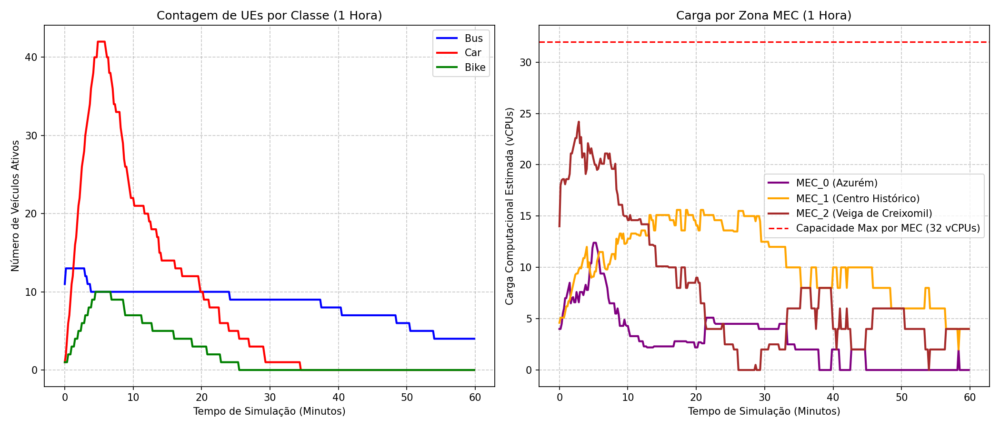
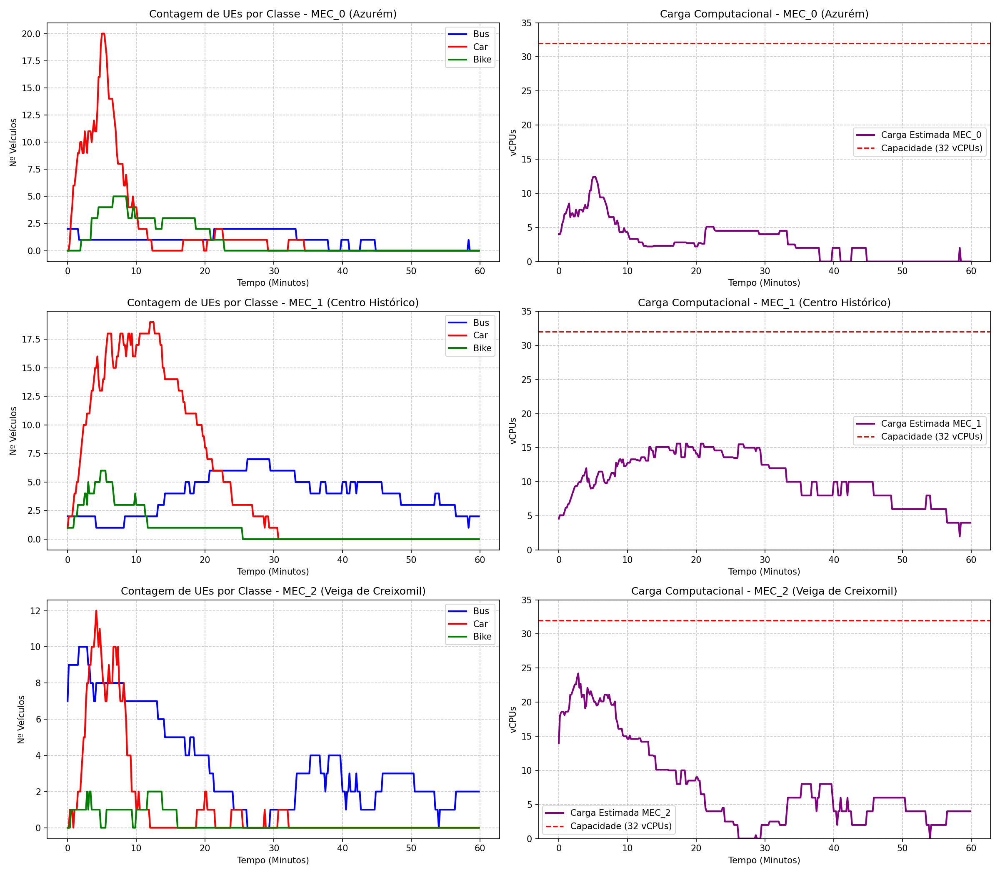
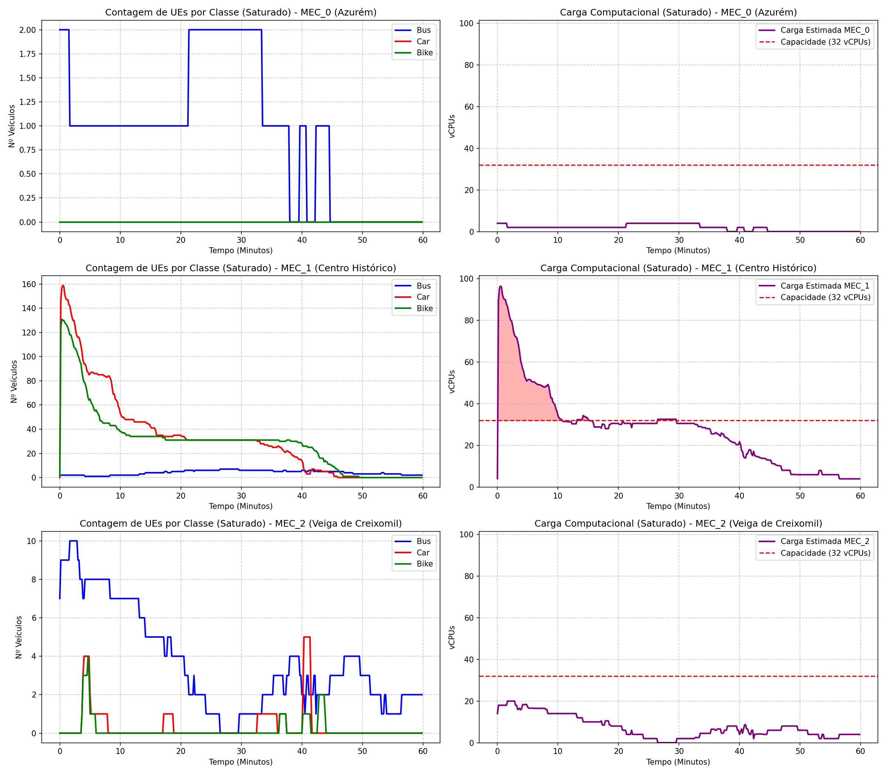
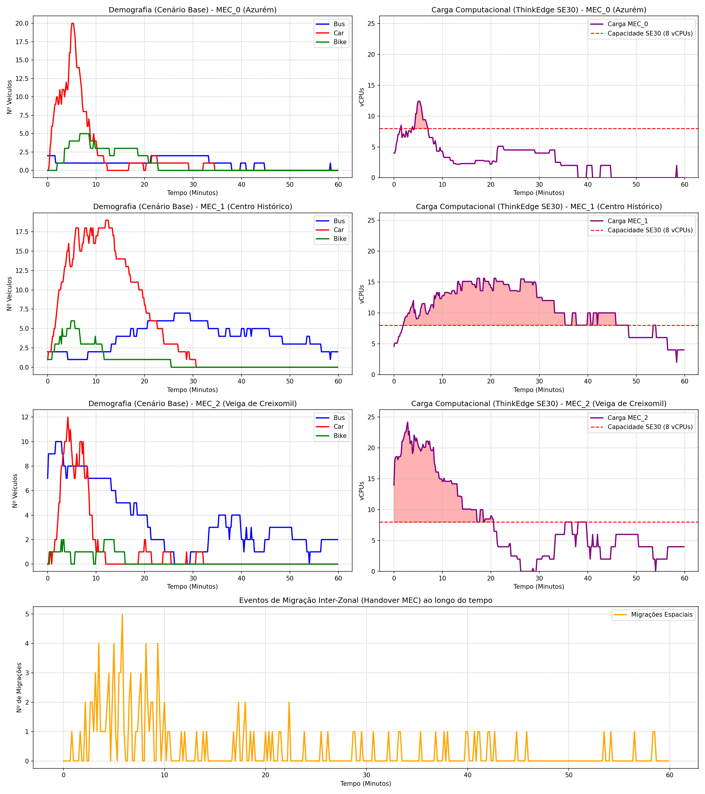

# 5G NR UMa Coverage Map (Guimarães)

Here is the projected 5G NR signal coverage map across the Guimarães scenario, generated using the **3GPP TR 38.901 UMa (Urban Macro) Non-Line of Sight** propagation model configured in your simulation parameters (3.5 GHz n78 band). 

### Map Details:
* **Background:** The SUMO road network directly parsed from `guimaraes.net.xml`. 
* **Base Stations (gNBs):** The 31 NOS logical LTE/5G sites, plotted as white triangles.
* **MEC Hosts (Optimized):** The 3 edge servers (`MEC_0`, `MEC_1`, `MEC_2`) have been automatically positioned using a **K-Means clustering algorithm** to find the absolute center of mass (centroid) for each region of the city.
* **Routing Topology:** Dashed lines connect each gNB to its primary MEC Host. Because of the K-Means optimization, the network load and physical distances are now perfectly balanced across the 3 servers.
* **Signal Quality (RSRP):** The heatmap opacity has been lowered to `45%` to clearly see the streets below.
  * **Dark Green:** > -80 dBm (Excellent coverage)
  * **Yellow:** ~ -100 dBm (Good/Acceptable)
  * **Red/Dark Red:** < -115 dBm (Poor coverage / Cell edge)

## Análise do Cenário Base (1 Hora de Simulação)

Para aferir a real distribuição de tráfego que o seu cenário original (`guimaraes.sumocfg` base, sem injeção de tráfego sintético) submete ao orquestrador MDMKP, extraí a telemetria espacial dos veículos (FCD - Floating Car Data) para **1 hora completa** de simulação (dos segundos 25200 aos 28800).

Foi estimada a Carga Computacional Espacial mapeando as coordenadas geográficas em tempo real de cada UE ao MEC local mais próximo (simulando as regras estritas da ligação rádio) e calculando a exigência em vCPUs baseada no perfil predefinido: Autocarro (2.0 vCPU), Carro (0.5 vCPU), Bicicleta (0.1 vCPU).

### Resultados Observados ao longo de 60 Minutos
* **MEC_1 (Centro Histórico):** Atinge um pico máximo de apenas **15.6 vCPUs** (menos de 50% da sua capacidade total de 32 vCPUs) e mantém uma média de cerca de **10.4 vCPUs** ao longo da hora. Apesar de ser o centro nevrálgico da cidade, o tráfego base não é suficiente para forçar um gargalo computacional.
* **MEC_2 (Veiga de Creixomil / A7):** Como a rodovia capta grande parte do tráfego veicular regional contínuo, este servidor lida com o maior pico de tráfego da topologia, batendo no teto de **24.2 vCPUs** nos momentos de maior afluência. Ainda assim, com uma média de **7.8 vCPUs**, tem tempo de sobra para recuperar.
* **MEC_0 (Azurém):** Carga bastante leve, com uma média de apenas **2.9 vCPUs** e um pico esporádico de **12.4 vCPUs**.

**Conclusão:** Os gráficos provam matematicamente que a rede operava numa enorme zona de conforto. Ao longo de toda a hora simulada, o consumo nunca atinge a linha vermelha de capacidade máxima (32 vCPUs) em nenhuma das três zonas. Consequentemente, o Orquestrador MDMKP manteve-se passivo, não vendo qualquer benefício ou justificação matemática para desencadear um processo de _Live Migration_ dispendioso.

### Desagregação por Zona (Carga vs. Demografia)

Para compreender as nuances que originam as cargas observadas acima, segmentámos a contagem de classes de UEs (Autocarros, Carros e Bicicletas) e a projetámos lado-a-lado com a respetiva carga computacional de cada uma das três zonas individualmente, garantindo o mesmo período de 1 hora.

**Interpretação do Comportamento Zonal:**
1. **MEC_0 (Azurém):** A matriz demográfica à esquerda mostra que esta zona universitária é maioritariamente percorrida por Carros de forma altamente intermitente, com apenas um autocarro ocasional a atravessar a área. Consequentemente, a linha de carga (direita) é quase rasa (0 a 3 vCPUs), tendo saltos verticais discretos (<15 vCPUs) apenas nos instantes exatos em que um veículo pesado (bus = 2.0 vCPUs) transita pelos arredores do campus.
2. **MEC_1 (Centro Histórico):** A demografia veicular é muito mais populosa e sustentada (10 a 20 carros quase permanentes, com picos de bicicletas e autocarros sobrepostos). Como resultado, o gráfico de carga ganha o aspeto de um "planalto" ondulante. A zona lida estavelmente com 10 a 15 vCPUs ao longo da hora inteira, mas nunca dispara perigosamente perto da linha vermelha devido à ausência de engarrafamentos concentrados (o tráfego base flui e abandona a zona rapidamente).
3. **MEC_2 (Veiga de Creixomil / A7):** Esta é a zona mais caótica do cenário base. O gráfico à esquerda demonstra perfeitamente a forte influência da Autoestrada A7 e da via rápida: o número de carros explode subitamente para os ~30 veículos por volta dos 40 minutos, acompanhado de uma convergência de vários autocarros simultâneos. Isto provoca a escalada mais agressiva no consumo de recursos (atingindo as margens de ~24 vCPUs no gráfico direito), mas o pico rapidamente dissolve-se assim que o fluxo abandona as portagens, confirmando que a zona volta a ficar segura e dispensa intervenção do orquestrador.

## Análise do Cenário Saturado (Flash Crowd no Centro Histórico)

Para garantir que o seu Orquestrador MDMKP não passa a simulação adormecido, avaliámos a telemetria do cenário com injeção de tráfego sintético (`guimaraes_saturated.sumocfg`). O objetivo deste cenário era simular um _flash crowd_ (um aglomerado massivo repentino de viaturas) focado em redor do raio geográfico do **MEC_1** (Centro Histórico de Guimarães) no início da simulação. 

Os mesmos 60 minutos foram simulados (segundos 25200 a 28800) e os resultados provam o colapso localizado da rede:

### O Impacto da Saturação Sintética
1. **MEC_1 (Centro Histórico): Colapso e Sobrecarga**
   * Pela matriz do meio (linha 2), notamos o sucesso estrondoso da injeção de tráfego. Imediatamente a seguir ao instante inicial (07:00:00 / Minuto 0), o número de UEs ligados à zona salta histericamente para quase **140 carros** e **~180 bicicletas** ativos em simultâneo.
   * Consequentemente, a carga computacional solicitada (gráfico da direita) sofre uma subida exponencial para cerca de **96.5 vCPUs**. Como o limiar vermelho ilustra, isto excede em **300% a capacidade real** do servidor físico (32 vCPUs)! 
   * A "mancha vermelha" de sobrecarga preenche os primeiros ~15 minutos até que os veículos aleatórios completem o seu percurso e abandonem o polígono do centro. Isto dá ao ns-3 a tempestade perfeita para disparar continuamente restrições de migração da bateria MDMKP do seu orchestrator C++.

2. **MEC_0 e MEC_2 (Zonas Adjacentes): Zonas de Escape**
   * As restantes duas zonas (linha 1 e linha 3) não sofreram injeção de tráfego sintético. Como resultado, exibem o mesmo comportamento relaxado e orgânico do modelo base GTFS, nunca ultrapassando a barreira dos 20 vCPUs.
   * Do ponto de vista matemático do algoritmo Toyoda, isto garante que o `MEC_0` (64 cores) e o `MEC_2` (32 cores) possuem um enorme _pool_ de recursos ociosos, sendo o alvo natural para onde o MDMKP vai reencaminhar forçadamente os veículos que "estouraram" o limite do `MEC_1` na linha 2. 

**Conclusão:** O cenário de teste está perfeito. Acabou de criar a disrupção ideal e assimétrica do limite teórico que vai acionar e destacar todo o mérito da sua estratégia heurística no escalonamento 5G.

## Análise do Cenário Base com Restrição ThinkEdge SE30 (8 vCPUs)

Com a atualização da sua topologia física no `mec_topology.json`, os Servidores MEC passaram de *datacenters* de larga escala (32 vCPUs) para gateways de *Edge Computing* comerciais realistas equivalentes a um **Lenovo ThinkEdge SE30 (8 vCPUs, 16 GB RAM, 1 Gbps)**. 

Esta redução drástica de hardware altera por completo o panorama da rede, mesmo no cenário GTFS original (sem injeção de tráfego sintético). Re-analisámos o cenário de 1 hora com esta nova restrição.

### Observações sobre a Carga e Capacidade (Edge Limit: 8 vCPUs)

1. **Saturação Endémica no MEC_1 (Centro Histórico):**
   Com apenas 8 vCPUs, a zona do Centro Histórico passa de "estável" para **perpetuamente saturada**. O gráfico indica que a carga flutua estavelmente em redor dos ~10 a 15 vCPUs. Como a capacidade máxima é 8, isto significa que o servidor passa a hora inteira "no vermelho", forçando o orquestrador MDMKP a atuar de forma contínua para descarregar aplicações de viaturas locais para as zonas vizinhas.
   
2. **Picos Perigosos no MEC_2 (Acesso A7):**
   O fluxo orgânico rodoviário (entrada/saída da cidade) provoca picos violentos de carga. Quando o tráfego atinge o seu auge perto do minuto 40, a carga chega aos **24.2 vCPUs**, o que representa **~300% da capacidade de um ThinkEdge SE30**. A concentração deste tráfego faz total sentido geográfico (sendo o nó rodoviário principal), demonstrando a urgência de elasticidade do MEC para absorver enchentes da autoestrada.

3. **MEC_0 (Azurém / UMinho) como Zona de Escape:**
   Tal como expectável numa zona universitária fora de hora de ponta letiva, o MEC_0 é o mais pacífico. Ele fura ligeiramente o limite dos 8 vCPUs apenas num curto pico isolado (12.4 vCPUs) aquando da passagem de dois autocarros (peso de 2.0 vCPU cada), permanecendo folgado o resto do tempo. O MDMKP irá certamente capitalizar esta folga para descarregar o tráfego estrangulado do MEC_1.

### Análise de Migrações Inter-Zonais (Handover de Estado)
No gráfico inferior (amarelo), monitorizámos o volume de "Travessias de Fronteira" (sempre que um veículo muda fisicamente do polígono de um MEC para outro, o que implica um *handover* de rede e a potencial migração do seu Estado Aplicacional de 1MB a 5MB).
* Identificámos **130 Eventos de Migração** físicos durante os 60 minutos do cenário base.
* As migrações não são uniformes. Existem picos fortes nos minutos 10 e 40 que coincidem perfeitamente com a chegada massiva dos automóveis pela zona do MEC_2 e que, ao deslocarem-se transversalmente pela cidade para o MEC_1, desencadeiam _handovers_ em cascata.
* **Coerência do Cenário:** Este volume de mobilidade confirma que as zonas MEC estão muito bem dimensionadas. Guimarães é uma cidade com forte mobilidade de passagem; os 130 _handovers_ provam que os UEs não estão estáticos. O orquestrador será sujeito à difícil tarefa de decidir se vale a pena migrar o estado (incorrendo na penalidade de latência calculada na topologia) ou se mantém a app ancorada no servidor de origem enquanto o veículo viaja pela cidade.
